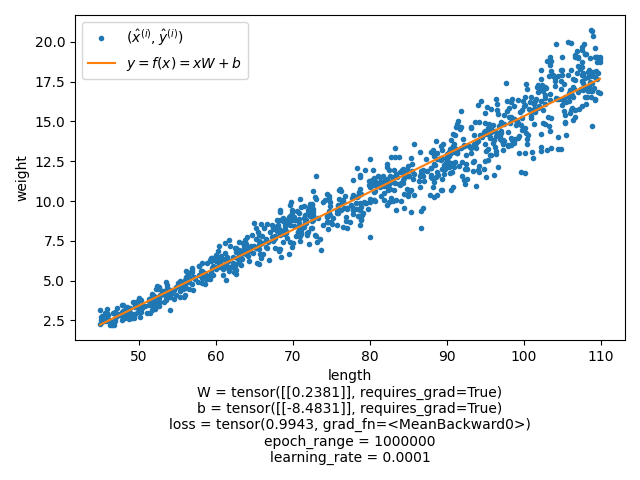
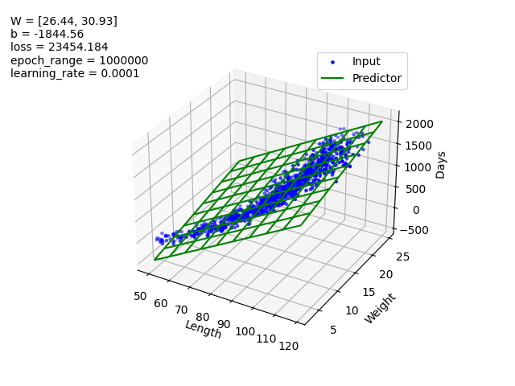
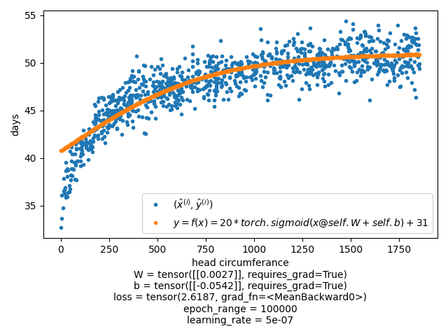

# Regression

### Linear regression
Regression to find expected weight of a small child based on its length(height). Here we use the model y=f(x)=xW+b

### Linear regression in 3 dimensions
Regression to find expected age (in days) of a small child based on its body measurments. Here we are using the same model as the one in 2 dimensions but now x, and therefore W, consists of 2 values 

### Non-linear regression
Trying to estimate the head circumference of a child based on its age (in days). For this we are using the model y=f(x)=20*sigmoid(xW+b)+31

