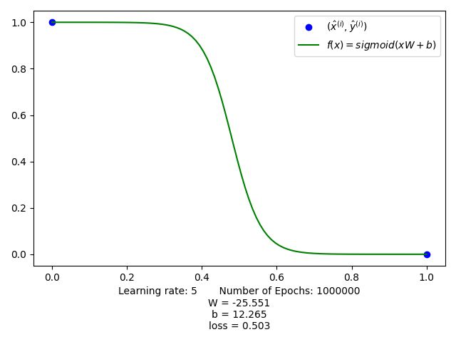
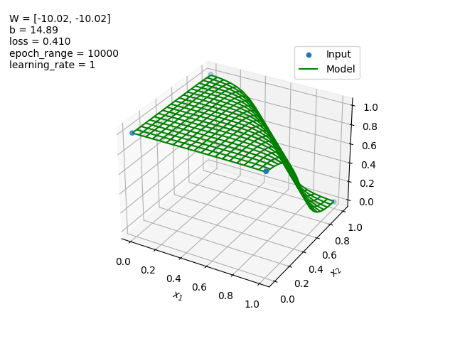
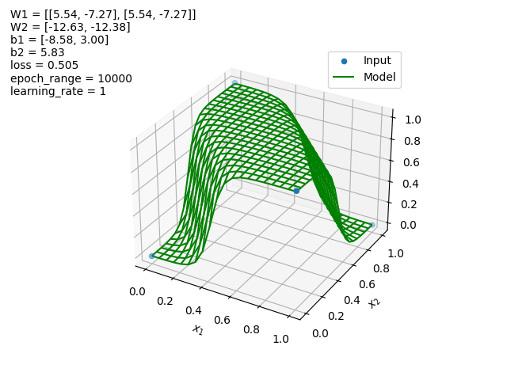
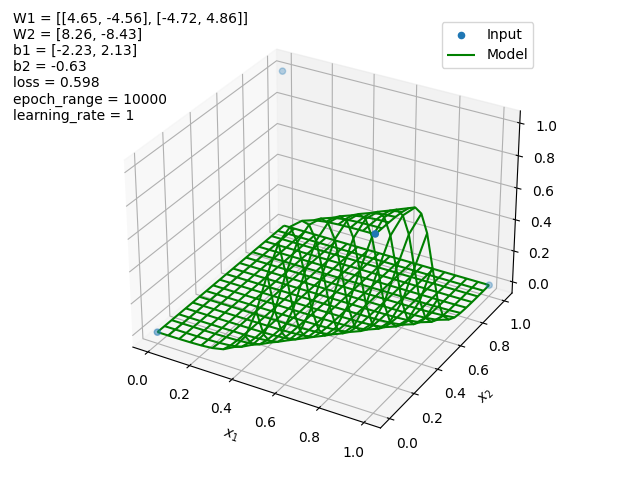
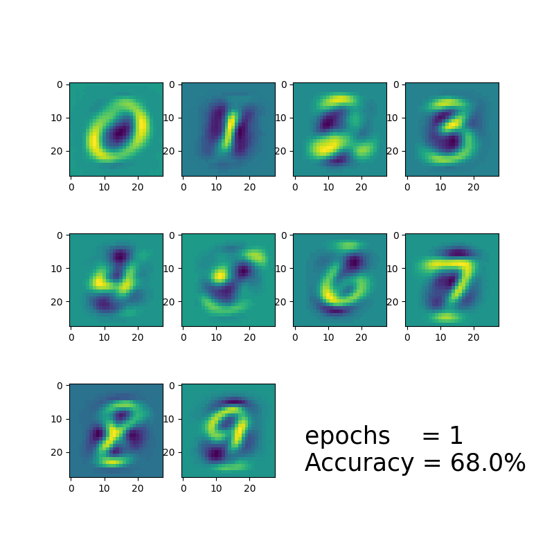

# Assignment 2 - Artifical neural networks

### NOT - operator



### NAND - operator


### XOR - operator
**Decent starting values**

```python
W1_init = [[1.0, -1.0], [1.0, -1.0]]
W2_init = [[-1.0], [-1.0]]
b1_init = [[1.0, 1.0]]
b2_init = [[-1.0]]
```



**Bad starting values**

```python
W1_init = [[1.0, -1.0], [1.0, 1.0]]
W2_init = [[-1.0], [-1.0]]
b1_init = [[-1.0, -1.0]]
b2_init = [[-1.0]]
```




### Number recognision

The following shows a gif visualizing how W changes depending on how many epochs the neural network runs:




