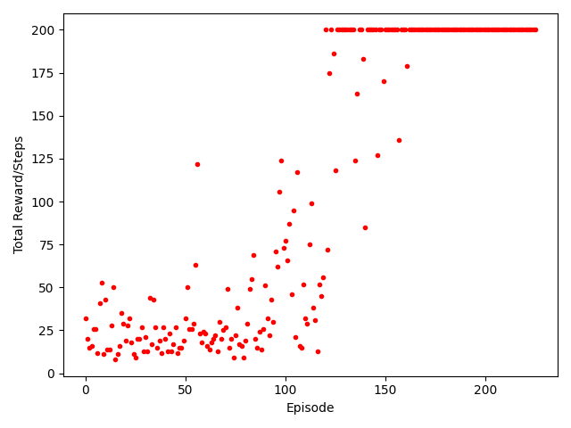
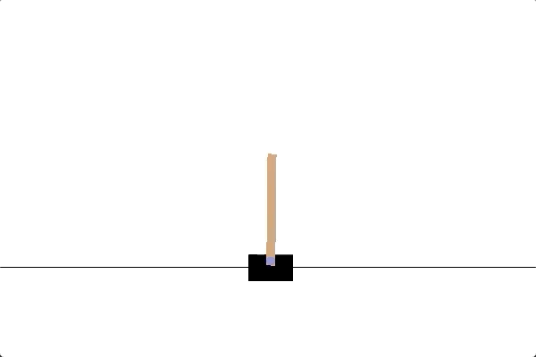
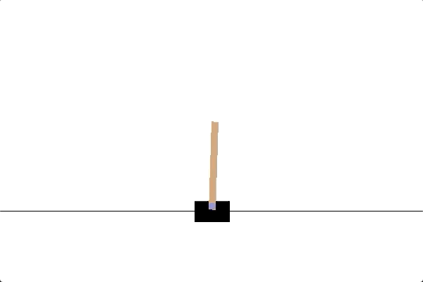
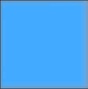
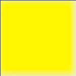
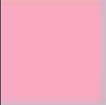
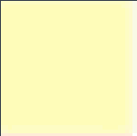
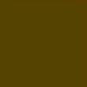

# Reinforcement learning
In this assignment you will use **Q-learning**.

## Part A - Cartpole
Implement Q-learning and use it to solve the  
**CartPole-environmentet**   
[[i]](https://gym.openai.com/envs/CartPole-v0/) A pole is attached by an un-actuated joint to a cart, which moves along a frictionless track. The system is controlled by applying a force of +1 or -1 to the cart. The pendulum starts upright, and the goal is to prevent it from falling over. A reward of +1 is provided for every time-step that the pole remains upright. The episode ends when the pole is more than 15 degrees from vertical, or the cart moves more than 2.4 units from the center.  
CartPole-v0 is considered "solved" when the agent obtains an average reward of at least 195.0 over 100 consecutive episodes.  

Tip: you can find examples and inspiration at [openai/gym](https://github.com/openai/gym)

### Results
I based my implementation on the solution of the cartpole problem by RJBrooker that can be found
[here](https://github.com/RJBrooker/Q-learning-demo-Cartpole-V1/blob/master/cartpole.ipynb). He also made a [video explanation](https://www.youtube.com/watch?v=JNKvJEzuNsc&ab_channel=EduonixLearningSolutions).

Here is the plotted total reward (number of steps) the agent gets for each episode:   
  

Console output:
```console
Solved after 126 episodes
```
#### Before training:
  

#### During training:
  

#### After training:
  


## Part B - Gridworld with visualization
Create a simple gridworld environment. This entails that the environment has a discrete grid, and that an agent can move around with four actions (up, down, left and right).  
The simulation terminates once the agent has reached a placed goal position that yields a reward of 1.   
If you wish, you can add things like: solid walls, danger areas etc.    
The environment should have the same interface as cartpole (.step(a)-function, and reset()).    
Then the implementation of Q-learning from Part A be used to train an agent in the environment.  
Finally you should visualize the Q-values in the environment itself. This can be done in different ways. such as:
- Color grading the tiles based on the highest q-value
- Draw arrows pointing in the same direction as the action with the highest Q-value.

Tip: the library *pygame*  is great for visualizing the environment.

### Results
I implemented a couple of extra features, such as obstacles, dangers and bonuses where the obstacles simply prohibit movement, the dangers yields a negative reward when stepped on, and bonuses gets collected and yields a small positive reward. In the grid you can identify these, the agent, and the goal by their color:  






#### Before training:
The agent moves mostly upwards because all the values in the Q-table is zero, and therefore the
```python
np.argmax(Q_table[state])
```
simply returns the first index because all the elements are equal. And the the first action is `up`

  

#### During training:
Here i am visualizing how the Q-Table changes as the agent moves across the board, in the beginning the movements are almost entirely random but they get less and less random after each episode. The gradient goes from red to green. Red means the expected reward from going to this tile is low, and green for an expected high reward. For the gray tiles all the expected rewards for actions in that tile is currently zero because the agent hasn't yet "discovered" an expected reward for them.  




  

#### After training:
After a couple episodes we can clearly see how the agent avoids the dangerous tiles, and even picks up a couple of bonuses on its way to the goal:

  
