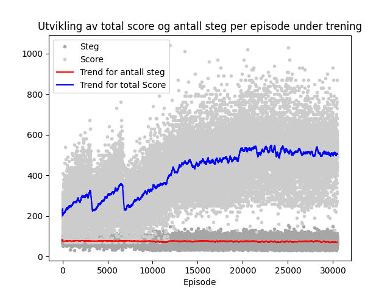

# TDAT3025 machine learning project
## How to play
To play in the environment yourself, just run the `play.py` file.
- You control Pac-Man with the arrowkeys
- you can toggle "hacks" by hitting 'p'(ghost paths), 't'(ghost targets) or 'h'(both targets and paths), on your keyboard.
- press 'space' to pause or 'esc' to quit.

 

## Watch the agent
To watch how smart the current agent is (evaluate), run the `evaluate.py` file, there might be an error where PyTorch fails to read the saved networks, if that happens you unfortunately have to do the steps below to reset the agent.

## Train the agent
If you wish to train the agent more, this is within the `train.py` file. Select how many episodes you want to train for,
and how often the agent should be evaluated.

## Reset agent
To reset the agent if you want to train it from scratch, delete the files within the folders `Agent/data`, and `Agent/networks`

# Results

## What the agent sees

## Average of human players

## Average of random actions

## Progression of the training scores for the agent

## Progression of the agent

## AI Playing the game

